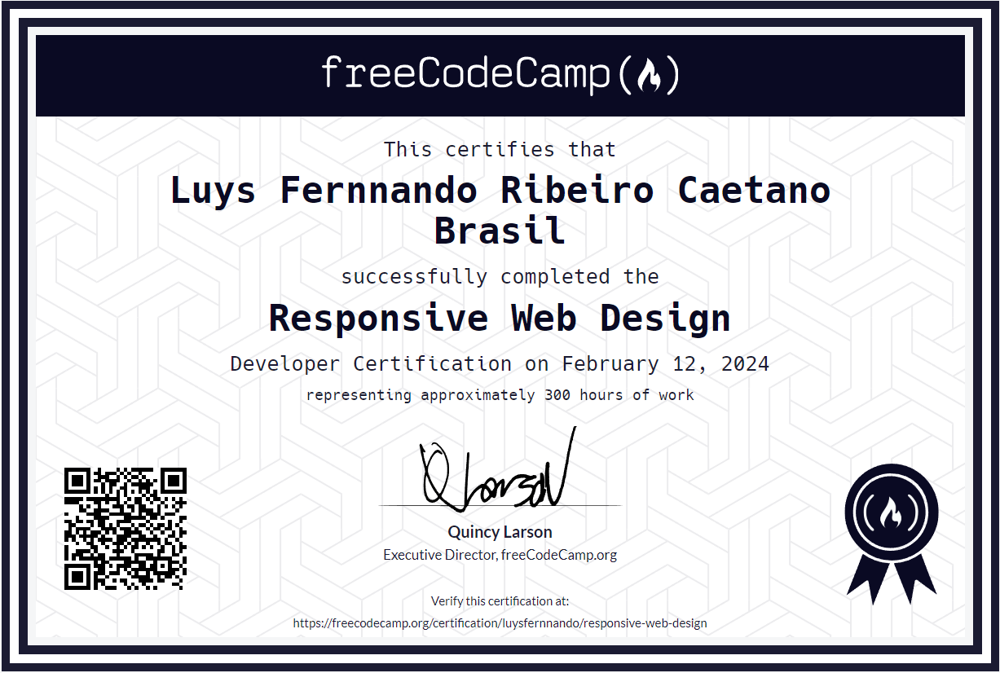

<h1 align="center">
  
</h1>
<br>
<p align="center">
  <a href="#projeto">Projeto</a>&nbsp;&nbsp;&nbsp;|&nbsp;&nbsp;&nbsp;
  <a href="#tecnologias">Tecnologias</a>&nbsp;&nbsp;&nbsp;|&nbsp;&nbsp;&nbsp;
  <a href="#certificados">Certificados</a>&nbsp;&nbsp;&nbsp;|&nbsp;&nbsp;&nbsp;
  <a href="#executando">Executando o projeto</a>&nbsp;&nbsp;&nbsp;|&nbsp;&nbsp;&nbsp;
  <a href="#licenca">Licença</a>
</p>

<br>

<p align="center">
  
  
  
  
</p>

<h2 id="projeto">✨ Projeto</h2>

<p>
Esse repositório foi criado para ser dedicado aos projetos necessários para obter certificados no site <a href="https://FreeCodeCamp.org">FreeCodeCamp.org</a>, aqui você encontrará uma coleção dos meus projetos desenvolvidos para cumprir os requisitos do programa de certificação do FreeCodeCamp. Cada projeto reflete meu progresso e habilidades em diferentes áreas, desde desenvolvimento web até ciência de dados. Este repositório serve como um portfólio dinâmico, demonstrando meu aprendizado contínuo e meu compromisso com a prática e o aprimoramento das minhas habilidades de programação.
</p>

<h2 id="tecnologias">🚀 Tecnologias</h2>

<p>Esse projeto contará com as mais diversas tecnologias, como por exemplo:</p>

<table border="0">
 <tr>
<td> JavaScript</td>
<td> TypeScript</td>
<td> React.JS</td>
<td> PHP</td>
<td> Laravel</td>
<td> Inertia.js</td>
<td> HTML / CSS</td>
 </tr>
</table>

<h2 id="certificados">🌟 Certificados</h2>

- [x] <a href="https://www.freecodecamp.org/certification/luysfernnando/responsive-web-design">Responsive Web Design</a>
- [ ] Front End Development Libraries
- [ ] Penalidades divididas por categorias.
- [ ] Relational Database
- [ ] Back End Development and APIs
- [ ] Quality Assurance
- [ ] Information Security

<h2 id="executando">👨🏻‍💻 Executando os projetos</h2>

<p>
Projetos usando <em>React</em>:<br>
Utilize o <strong>yarn</strong> ou o <strong>npm install</strong> para instalar as dependências do projeto.<br>
Em seguida, inicie o projeto.

Iniciando a versão web:</p>

```cl
yarn start ou npm run dev
```

<p>
Projetos usando <em>HTML</em>:<br>
Basta dar dois cliques para abrir os arquivos <code>index.html</code><br>
Obs.: Lembre-se de seguir a mesma estrutura de pasta/arquivos!
</p>

<h2 id="licenca">📝 Licença</h2>

<p>Esse projeto está sob a licença MIT. Veja o arquivo <a href="./LICENSE">LICENSE</a> para mais detalhes.</p>

---
